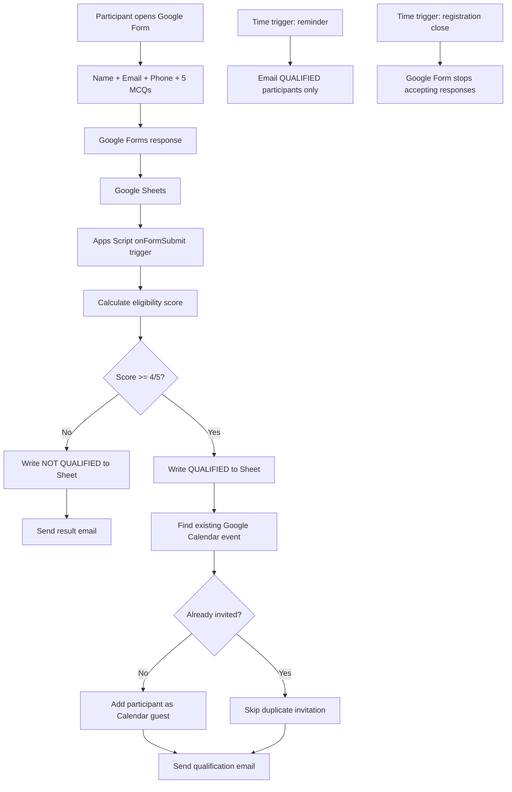
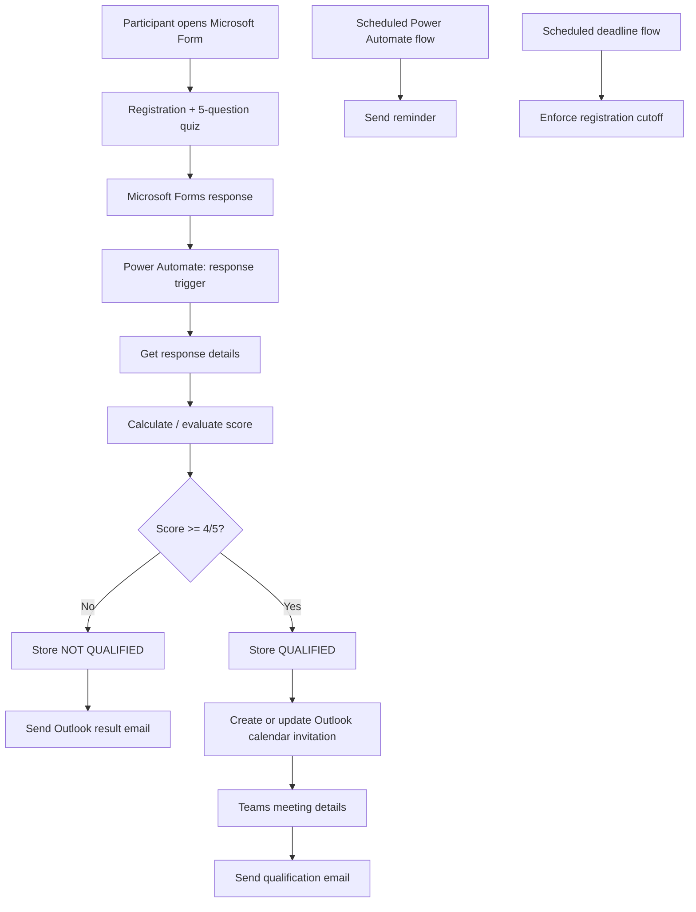

# Event Registration Automation Lab

A hands-on automation lab for building an end-to-end event registration workflow with eligibility testing, automated invitations, reminders, and registration closure.

This repository documents:

1. **Implemented Google Workspace workflow**
   - Google Forms
   - Google Sheets
   - Google Apps Script
   - Google Calendar
   - Google Meet
   - Automated email notifications

2. **Expected Microsoft 365 / Teams equivalent**
   - Microsoft Forms
   - Power Automate
   - Excel Online or SharePoint List
   - Outlook Calendar
   - Microsoft Teams
   - Automated Outlook email notifications

> The Google implementation was built and tested as a real event-registration workflow. The Microsoft 365 section is an implementation design for reproducing the same behavior with Teams.

---

## Use case

The event requires participants to complete a short eligibility quiz before receiving the meeting invitation.

### Business rules

- Collect participant **name, verified email, and mobile number**
- Ask **5 fundamental Linux/networking questions**
- Each question is worth **1 point**
- **4/5 or 5/5 = Qualified**
- Qualified participants:
  - receive a qualification email
  - are automatically added to the calendar event
  - receive the online meeting details
- Non-qualified participants:
  - receive a result email
  - are not added to the calendar event
- Qualified participants receive a reminder before the session
- Registration closes automatically at the configured deadline
- Duplicate meeting invitations and reminder emails are prevented

---

## Architecture

### Google Workspace implementation



### Microsoft 365 / Teams target design



---

## Repository structure

```text
event-registration-automation-lab/
├── README.md
├── google-workspace/
│   ├── README.md
│   └── apps-script/
│       └── Code.gs
└── microsoft-365/
    └── teams-power-automate-design.md
```

---

## Google implementation summary

The completed workflow uses the Google Form response spreadsheet as the automation source.

### Form configuration

- Quiz mode enabled
- Email collection enabled
- One response per participant recommended
- Correct answers hidden from participants
- Missed questions hidden
- Point values hidden
- Question/option shuffle can be enabled
- Script matches answers by **exact question text**, so question order does not matter

### Eligibility questions used in the lab

1. Which Linux command shows the current working directory?
2. Which command is commonly used to test whether a remote host is reachable over an IP network?
3. What is the main purpose of DNS?
4. Which protocol provides reliable, connection-oriented transport?
5. What is the default port for HTTPS?

The public repository intentionally does **not** include real participant data, private calendar IDs, OAuth details, or a live meeting URL.

### Response-sheet automation columns

The script adds operational columns such as:

```text
Eligibility Score
Eligibility Result
Invite Sent
Processed At
Reminder Sent
```

Example:

```text
5/5 | QUALIFIED     | YES | <timestamp> | YES
3/5 | NOT QUALIFIED | NO  | <timestamp> |
```

### Apps Script triggers

Three triggers are used:

| Function | Trigger | Purpose |
|---|---|---|
| `onFormSubmit` | Spreadsheet → On form submit | Score response and process pass/fail |
| `sendQualifiedCandidateReminder` | Time-driven | Send reminder only to qualified participants |
| `closeRegistrationForm` | Time-driven | Stop accepting registrations at deadline |

A helper function, `setupSessionAutomationTriggers()`, can create the two scheduled triggers while leaving the working `onFormSubmit` trigger unchanged.

---

## Validation performed

The pass workflow was validated end to end:

```text
Form submission
→ response recorded in Sheet
→ eligibility calculated
→ participant marked QUALIFIED
→ qualification email received
→ participant added to Calendar event
→ meeting invitation received
```

The fail-path test should verify:

```text
Score < 4/5
→ NOT QUALIFIED
→ Invite Sent = NO
→ result email received
→ no Calendar/meeting invitation
```

---

## Security and privacy

Do not commit:

- participant email addresses
- phone numbers
- Google Form response exports
- production Meet/Teams links
- OAuth tokens
- credentials
- private calendar/event IDs
- organization-specific secrets

Use placeholders in public code:

```javascript
MEET_LINK: "YOUR_MEETING_URL"
EVENT_TITLE: "YOUR_EVENT_TITLE"
```

---

## Microsoft Teams equivalent

See [microsoft-365/teams-power-automate-design.md](microsoft-365/teams-power-automate-design.md) for the expected Microsoft implementation.

The goal is feature parity with the Google workflow:

```text
Microsoft Forms
→ Power Automate
→ Score / eligibility condition
→ Outlook email
→ Outlook Calendar / Teams invitation
→ scheduled reminder
→ registration cutoff
```

---

## Why this lab is useful

This is more than a form. It demonstrates practical workflow automation concepts:

- event-driven automation
- conditional branching
- idempotency / duplicate prevention
- scheduled automation
- external-service integration
- state tracking
- notification workflows
- privacy-aware automation
- failure-path testing

These patterns also apply to onboarding, training enrollment, candidate screening, workshop registration, access approval, and internal platform workflows.

## What You Should Be Able to Explain After Completing This Lab

You should be able to:

- Explain the complete event-driven flow from form submission to qualification and invitation.
- Explain how Google Forms, Sheets, Apps Script, Calendar, Meet, and email integrate in the implemented solution.
- Explain why `onFormSubmit` is appropriate for the eligibility workflow.
- Explain the pass and fail paths and how the automation prevents duplicate invitations.
- Explain why scheduled triggers are used for reminders and registration closure.
- Explain how state is tracked in the response sheet and why idempotency matters.
- Explain the privacy controls required before publishing automation code or evidence.
- Describe how the same architecture maps to Microsoft Forms, Power Automate, Outlook, and Teams.
- Explain how to validate both successful and unsuccessful workflow paths.
- Reuse the same automation patterns for onboarding, training, approvals, and other event-driven workflows.
